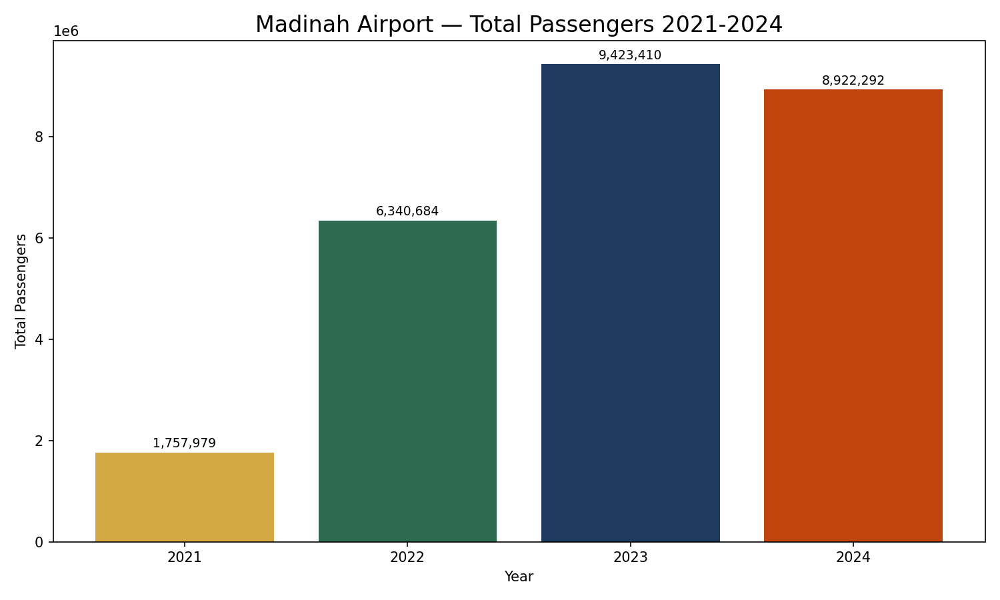
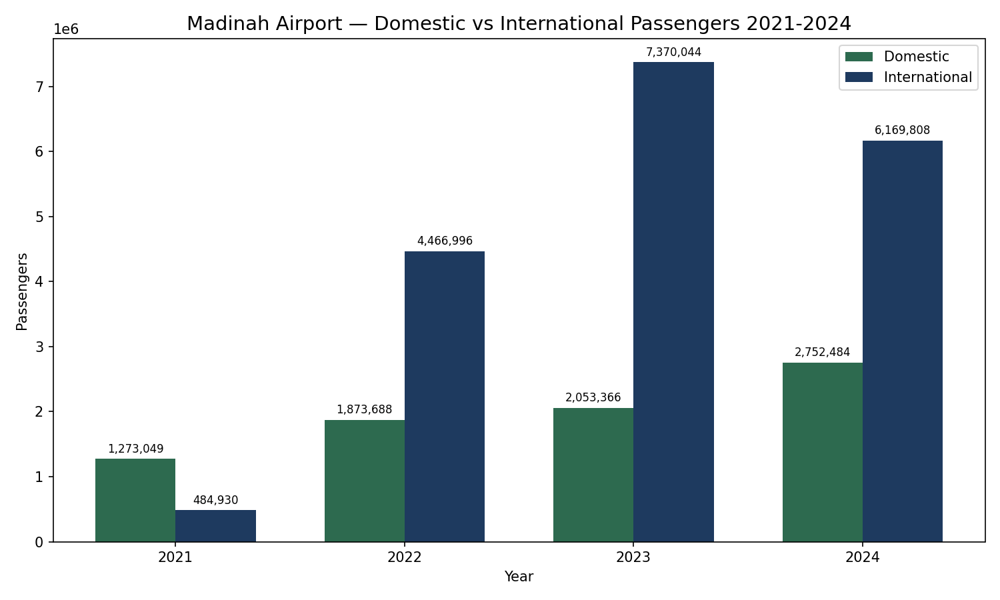
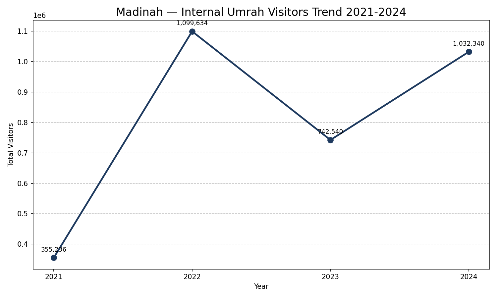
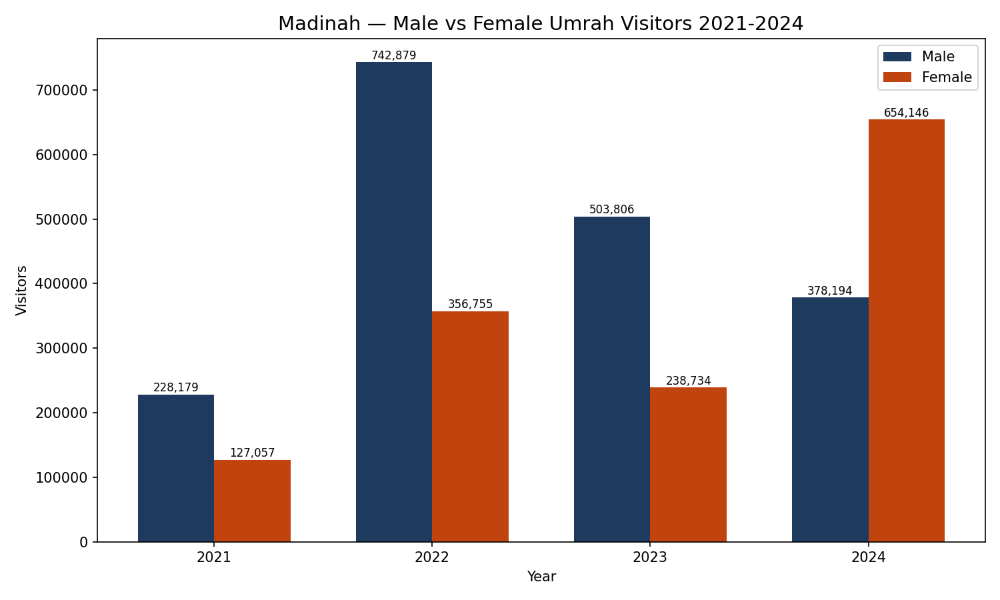
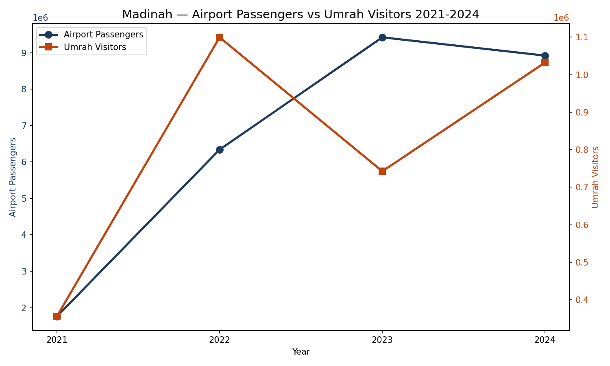
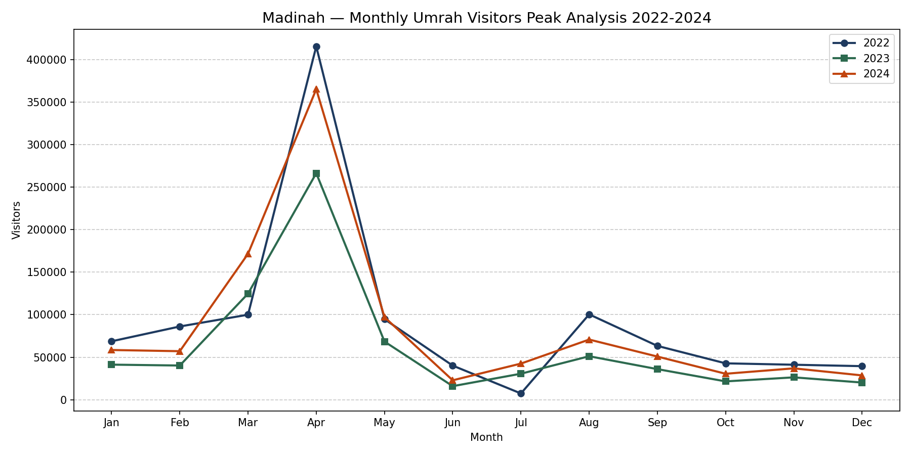

# 🕌 Madinah City Intelligence Report
## Airport Traffic & Pilgrim Visitor Analysis 2021-2024


## 📌 Project Overview
A comprehensive data analysis project analyzing Madinah city's airport 
traffic and Umrah pilgrim visitor patterns from 2021 to 2024 using real 
Saudi government data from GASTAT and GACA.

## 🎯 Objectives
- Analyze Madinah airport passenger trends post-COVID
- Extract and visualize Umrah visitor patterns by gender
- Identify peak months and seasonal patterns
- Build an interactive dashboard using Python Dash

## 💡 Key Insights
- ✈️ Airport passengers grew **5x** from 2021 to 2023 — COVID recovery story
- 📈 2023 was peak year with **9.4 Million** passengers
- 👩 In 2024 female Umrah visitors exceeded males for first time in dataset
- 🌙 **April (Ramadan)** is consistently the peak month every year
- 📉 July is consistently the lowest month for Umrah visitors

 📊 Charts

 Chart 1 — Airport Total Passengers


 Chart 2 — Domestic vs International


 Chart 3 — Umrah Visitors Trend


 Chart 4 — Male vs Female Visitors


 Chart 5 — Combined Analysis


 Chart 6 — Monthly Peak Analysis


 🗂️ Project Structure
## 🗂️ Project Structure
```
madinah-intelligence-report/
├── step1_load_and_import.py       ← Libraries and file loading
├── step2_explore_sheets.py        ← Sheet exploration
├── step3_search_madinah.py        ← Search Madinah in files
├── step4_peek_madinah.py          ← Peek inside sheets
├── step5_extract_madinah.py       ← Extract Madinah rows
├── step6_search_umrah.py          ← Umrah data exploration
├── step_7_extract_air_data.py     ← Air transport extraction
├── step8_extract_umrah_data.py    ← Umrah data extraction
├── step9_compile_data.py          ← Clean data compilation
├── step10_charts.py               ← Individual charts
├── final_analysis.py              ← Complete analysis file
├── dashboard.py                   ← Interactive Dash dashboard
├── chart1_airport_total.png       ← Airport total passengers chart
├── chart2_domestic_vs_international.png  ← Domestic vs international
├── chart3_umrah_trend.png         ← Umrah visitors trend
├── chart4_male_vs_female.png      ← Male vs female visitors
├── chart5_combined.png            ← Combined analysis
├── chart6_monthly_peak.png        ← Monthly peak analysis
├── Air Transport 2021.xlsx        ← GACA air data 2021
├── Air Transport 2022.xlsx        ← GACA air data 2022
├── Air Transport 2023.xlsx        ← GACA air data 2023
├── Air Transport 2024.xlsx        ← GACA air data 2024
├── Umrah Statistics2021.xlsx      ← Umrah data 2021
├── Umrah Statistics2022.xlsx      ← Umrah data 2022
├── Umrah Statistics2023.xlsx      ← Umrah data 2023
├── Umrah Statistics Q1 2024.xlsx  ← Umrah Q1 2024
├── Umrah Statistics Q2 2024.xlsx  ← Umrah Q2 2024
├── Umrah Statistics Q3 2024.xlsx  ← Umrah Q3 2024
└── Umrah Statistics Q4 2024.xlsx  ← Umrah Q4 2024
```

 🛠️ Tools & Libraries
- **Python 3.14**
- **Pandas** — Data extraction and manipulation
- **Matplotlib** — Static chart generation
- **Dash & Plotly** — Interactive dashboard
- **OpenPyXL** — Excel file reading

 📂 Data Sources
- **GACA** (General Authority of Civil Aviation) — Air Transport Statistics 2021-2024
- **GASTAT** (General Authority for Statistics) — Umrah Statistics 2021-2024
- Source: [stats.gov.sa](https://www.stats.gov.sa)

 📋 Data Privacy & PDPL Compliance
This project follows **Saudi Personal Data Protection Law (PDPL)** principles:
- ✅ All data is publicly available government data
- ✅ No personal or individual data collected
- ✅ Aggregate statistics only
- ✅ Data used strictly for analytical purposes
- ✅ Sourced from official government portal (stats.gov.sa)

 🎓 About
- **Author:** Bushra Sadaf
- **Education:** BCA — IGNOU
- **Certification:** IBM Data Analyst Professional Certificate | Unnati 'Business Associate' Certificate
- **Skills:** Python, Pandas, Matplotlib, Dash, Excel, SQL, Problem Solving 
- **Email:** bsadaf.official@gmail.com
